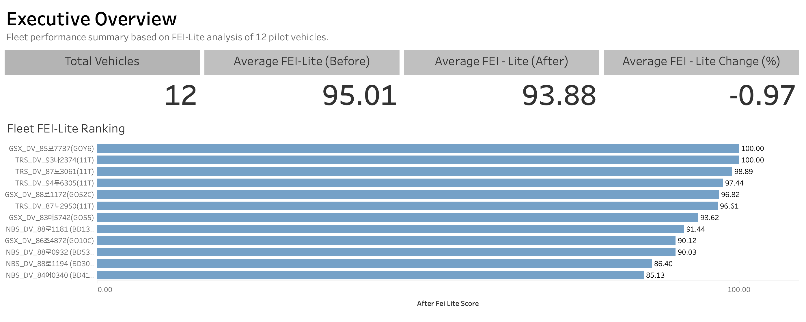
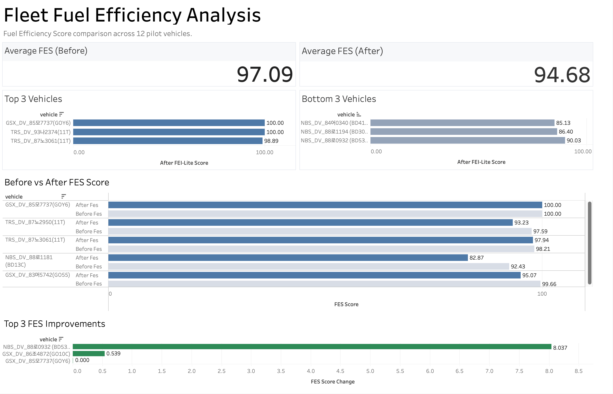
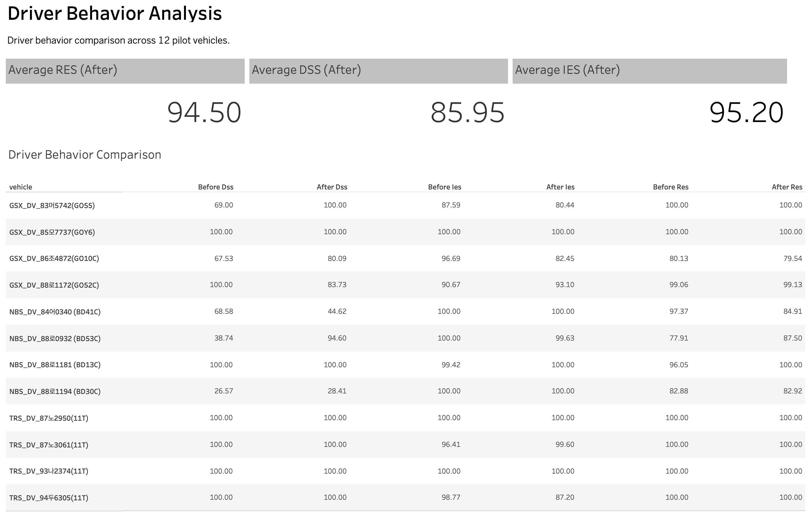
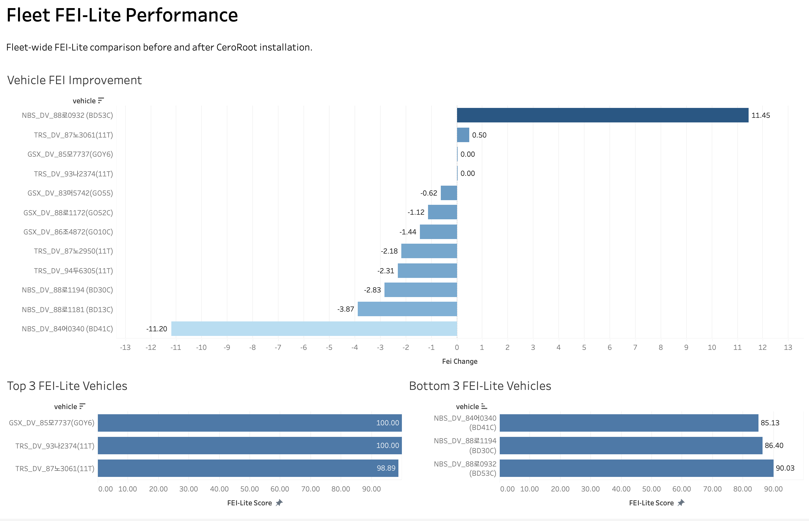

# Fleet Telematics Analytics using GeoTab Data

## Project Overview

This project analyzes fleet telematics data collected from a 12-vehicle logistics pilot fleet using the GeoTab platform.

The objective of this project was to evaluate vehicle performance before and after the installation of a fuel-saving device by building a practical fleet analytics framework using the signals that were actually available from GeoTab.

The project covers the complete analytics workflow from raw data extraction to dashboard visualization and was developed as an end-to-end data analytics portfolio project.

---

## Business Problem

One of the biggest challenges of this project was that many of the engine signals required for a complete Fuel Efficiency Index (FEI) were not available from the vehicles.

Several advanced diagnostics such as Engine Load, Fuel Rate, NOx, DPF Status, and SCR Efficiency were either missing or unsupported depending on the vehicle.

Instead of stopping the analysis, I designed a simplified scoring framework (FEI-Lite) using reliable signals that were consistently available across the fleet.

This allowed meaningful vehicle comparisons while documenting the limitations of the available telematics data.

---

## Project Objectives

- Validate available GeoTab vehicle signals
- Build a clean telematics dataset
- Engineer vehicle performance KPIs
- Design the FEI-Lite scoring framework
- Compare vehicle performance before and after installation
- Build interactive Tableau dashboards
- Translate technical findings into business insights

---

## Dataset

Source

- GeoTab API
- Logistics Pilot Fleet

Fleet

- 12 Vehicles
- Heavy Duty Vehicles (HDV)
- Light Duty Vehicles (LDV)

Study Period

Before

- April 18, 2026 – May 18, 2026

After

- May 19, 2026 – June 19, 2026

---

## Project Workflow

```
GeoTab API
      │
      ▼
Signal Validation
      │
      ▼
Data Cleaning
      │
      ▼
Feature Engineering
      │
      ▼
Vehicle KPI Dataset
      │
      ▼
FEI-Lite Calculation
      │
      ▼
Tableau Dashboard
      │
      ▼
Fleet Performance Insights
```

---

## Technologies

- Python
- Pandas
- GeoTab API
- Tableau
- Git
- GitHub

---

## Feature Engineering

The following vehicle metrics were calculated for each vehicle.

- Fuel Efficiency
- Distance Traveled
- Fuel Consumption
- Idle Ratio
- Average RPM
- Driving Smoothness
- Coolant Temperature
- Vehicle-Level KPI Summary

---

## FEI-Lite Framework

Since the complete FEI model could not be implemented due to unavailable vehicle signals, a lightweight scoring model was developed.

The final FEI-Lite score consists of four components.

| Component                      | Weight |
| ------------------------------ | -----: |
| Fuel Efficiency Score (FES)    |    50% |
| RPM Efficiency Score (RES)     |    20% |
| Idle Efficiency Score (IES)    |    20% |
| Driving Smoothness Score (DSS) |    10% |

```
FEI-Lite

= 0.50 × FES
+ 0.20 × RES
+ 0.20 × IES
+ 0.10 × DSS
```

---

## Dashboard

The Tableau dashboard includes the following pages.

### Fleet Overview



- Fleet Summary
- Vehicle Ranking
- Average FEI
- Overall Improvement

### Fuel Analytics



- Fuel Efficiency Comparison
- FES Analysis
- Before vs After

### Driver Behavior



- RPM Efficiency
- Idle Efficiency
- Driving Smoothness

### FEI-Lite Ranking



- Vehicle Ranking
- Improvement Analysis
- Top Performers

### Signal Validation

- Available Signals
- Missing Signals
- FEI Component Validation

---

## Key Findings

- Successfully validated the available GeoTab vehicle signals.
- Built a reusable Python data processing pipeline.
- Developed a practical FEI-Lite framework using available vehicle data.
- Compared vehicle performance before and after installation.
- Created executive dashboards for fleet performance monitoring.
- Documented signal limitations to support future FEI development.

---

## Repository Structure

```
fleet-telematics-fei-lite/

│
├── data/
├── dashboards/
├── docs/
├── images/
├── outputs/
├── src/
├── README.md
```

---

## Future Improvements

Future work may include:

- Machine Learning based fuel consumption prediction
- Driver clustering
- Route normalization
- Weather normalization
- Full FEI implementation using additional ECU signals
- Digital Twin integration

---

## Author

Haneul Jang

MS Mathematics

City College of New York

Aspiring Data Analyst / Data Scientist
