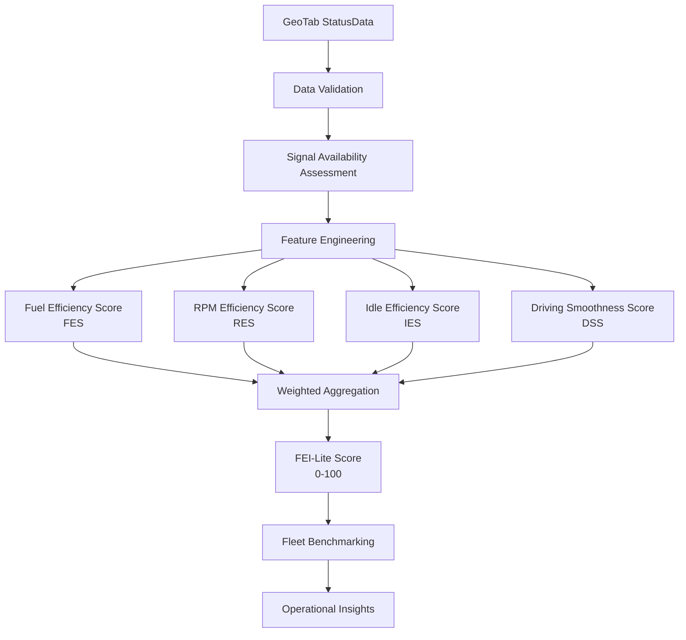

# FEI-Lite Calculation Flow

```mermaid
flowchart TD

    A[GeoTab StatusData]
    B[Data Validation]
    C[Signal Availability Assessment]
    D[Feature Engineering]

    E[Fuel Efficiency Score<br/>FES]
    F[RPM Efficiency Score<br/>RES]
    G[Idle Efficiency Score<br/>IES]
    H[Driving Smoothness Score<br/>DSS]

    I[Weighted Aggregation]
    J[FEI-Lite Score<br/>0-100]
    K[Fleet Benchmarking]
    L[Operational Insights]

    A --> B
    B --> C
    C --> D

    D --> E
    D --> F
    D --> G
    D --> H

    E --> I
    F --> I
    G --> I
    H --> I

    I --> J
    J --> K
    K --> L
```
